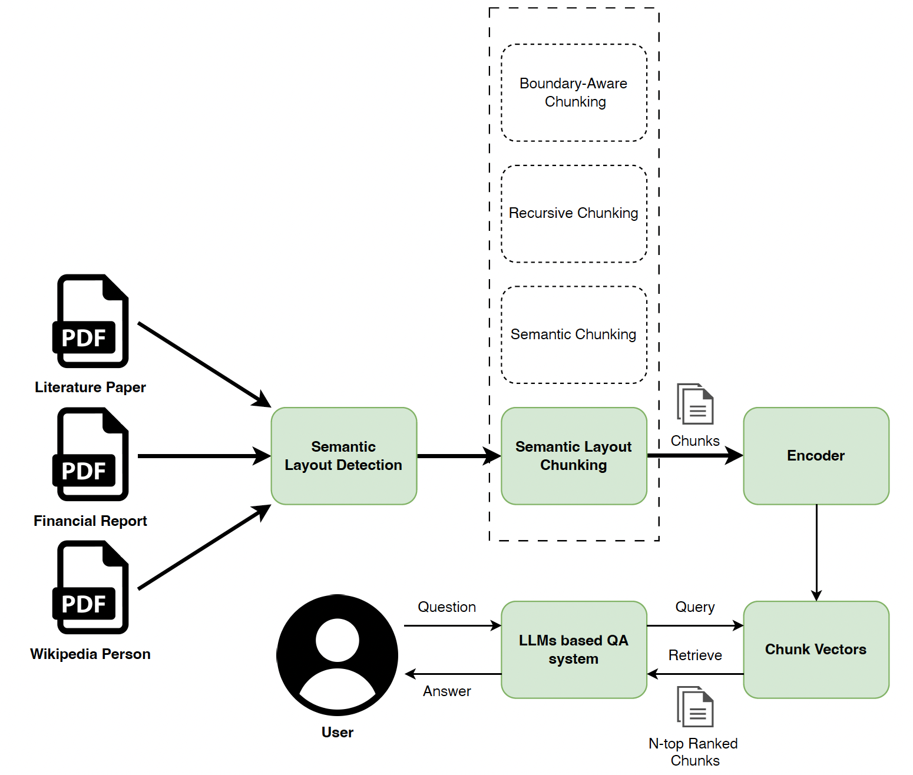

# Enhancing RAG System Performance Through Semantic Layout Chunking
This repository contains the implementation and datasets for "Enhancing RAG System Performance Through Semantic Layout Chunking".

## 🎯 Overview
Retrieval-Augmented Generation (RAG) systems rely heavily on effective document chunking strategies. While most existing methods focus on either semantic coherence or structural boundaries, our approach combines both by preserving semantic layout information during the chunking process.

- **Novel Chunking Strategy:** Introduces semantic layout-based chunking that preserves both structural integrity and semantic flow.
- **Comprehensive Evaluation:** Systematic comparison across three document domains (literature papers, financial reports, Wikipedia pages).
- **Annotated Dataset:** 70 documents with semantic layout labels across multiple domains.

## 📊 Results
|      Domain      | Method | Retrieval Accuracy | BLEU | ROUGE-P | ROUGE-R | ROUGE-F1 |
|:----------------:|:------:|:------------------:|:----:|:-------:|:-------:|:--------:|
| Literature Paper | FixedToken |        65.2        | 7.3  |  25.3   |  42.6   |   27.2   |
|                  | FixedSentence |        67.3        | 4.9  |  24.5   |  39.9   |   24.1   |
|                  | FiexedParagraph |        60.7        | 8.1  |  26.9   |  48.2   |   29.0   |
|                  | Recursive |        62.5        | 7.5  |  23.3   |  45.9   |   25.3   |
|                  | Sem-Embed |        58.0        | 8.1  |  24.4   |  41.6   |   26.8   |
|                  | Sem-Layout |        70.7        | 10.2 |  23.8   |  56.9   |   28.6   |
|     Fiancial     | FixedToken |        63.8        | 0.9  |   4.3   |  17.3   |   3.5    |
|                  | FixedSentence |        64.9        | 0.2  |   0.5   |  16.9   |   0.9    |
|                  | FiexedParagraph |        61.8        | 0.4  |   0.7   |  20.1   |   1.4    |
|                  | Recursive |        62.1        | 0.7  |   0.3   |  10.5   |   0.7    |
|                  | Sem-Embed |        55.3        | 1.5  |   4.0   |   8.6   |   2.9    |
|                  | Sem-Layout |        72.5        | 0.7  |   4.7   |  22.0   |   5.4    |
|    WikiPerson    | FixedToken |        54.6        | 20.0 |  63.6   |  62.9   |   57.0   |
|                  | FixedSentence |        56.5        | 25.3 |  72.5   |  65.6   |   64.0   |
|                  | FiexedParagraph |        52.7        | 23.0 |  69.2   |  63.0   |   60.4   |
|                  | Recursive |        50.9        | 24.7 |  64.5   |  60.8   |   55.7   |
|                  | Sem-Embed |        46.4        | 23.1 |  65.4   |  65.2   |   60.9   |
|                  | Sem-Layout |        58.0        | 22.5 |  63.5   |  67.7   |   62.7   |

## 🏗️ Architecture
Our approach consists of four main stages:
<p align="center">
  
</p>

1. Document Layout Detection: Using DocLayout-YOLO to identify structural elements
2. Use a human annotation tool Doc2KG (https://app.ai4wa.com/) to verify the results.
3. Semantic Layout Annotation: Mapping structural elements to semantic roles
4. Text Extraction & Post-processing: OCR(Tesseract-OCR) and PDFPlumber extraction with semantic label preservation.


## 🚀 Quick Start
**Installation**
```bash
git clone https://github.com/Lumanman9/Semantic_Layout_Chunking.git
cd Semantic_Layout_Chunking
pip install -r requirements.txt
```
**Running Experiments**
```bash
python experiment.py --chunking_method token_chunker --dataset Literature_Paper --length 500

```

## 📁 Dataset

**UDA Benchmark Subset** 

Original Dataset Link: https://github.com/qinchuanhui/UDA-Benchmark

**Full Dataset Link**

https://drive.google.com/drive/folders/1cpPdFpn3WNeJDHs2UvZqsoKEHstCUOsZ?usp=sharing


